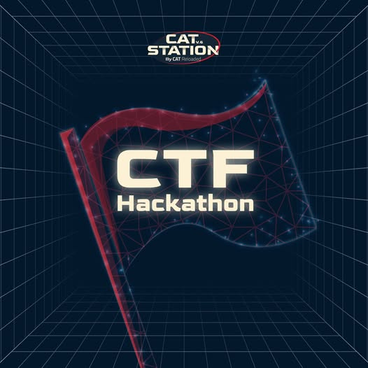

Hey folks,

Today, we’ll be walking through the Forensics challenges I’ve tackled at CAT CTF 25, Insha’allah.

It’s worth mentioning that I’ve got my first **First Blood** in **[Loser]** challenge🩸

**Note:** I’ve added [Erased Traces] challenge with the intended solution, as I was so close to the solution during the CTF but unfortunately couldn’t make it.

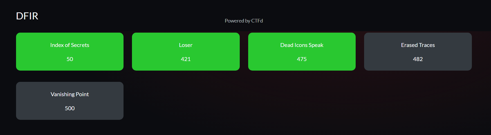

***

> **Index of Secrets**

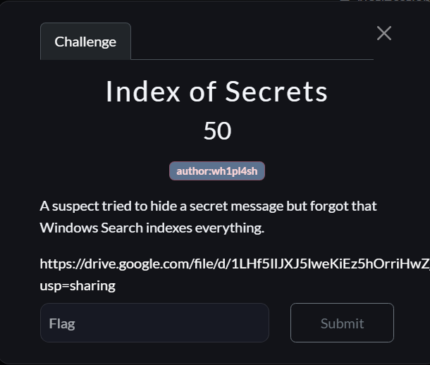

After extracting the zip archive we got a triage acquisition for the `C:` drive.

I checked the `Recent` directory to check the recently accessed files, located in:

```
C:\Users\wh1pl4sh\AppData\Roaming\Microsoft\Windows\Recent
```

I found a shortcut `.lnk` file called `flag.txt`, pointing to the desktop of the user `wh1pl4sh`.

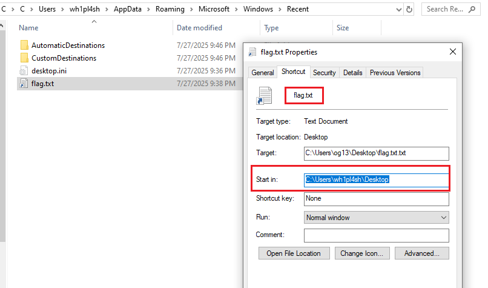

So what is the Windows Search Index?

The windows search indexing is a background service that improves the speed and efficiency of searches in windows by pre-building an index of files, emails, and other content on your system.

It works using indexers that scans files/folders and stores metadata like `File Name`, `File Type`, `Location`, `Date Modified`, `Contents (text contents is indexed but punctuation is not)`

And saves this data to a local index database, located at:

```
C:\ProgramData\Microsoft\search\data\applications\windows\Windows.edb
```

Then when you use windows search, it queries the index instead of scanning the disk.

I used [WinSearchDBAnalyzer](https://github.com/moaistory/WinSearchDBAnalyzer) tool to parse and explore the windows search index database.

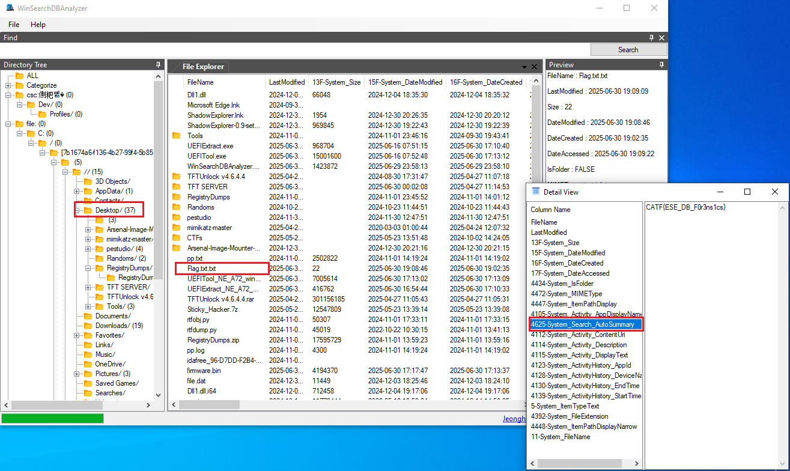

***

> **Loser**

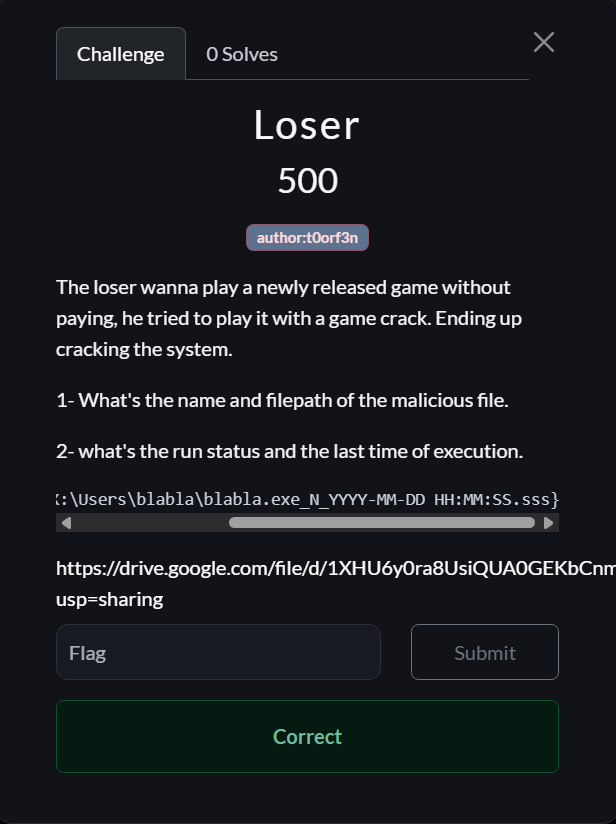

After extracting the zip archive, we got a triage acquisition for almost the `C:` drive with multiple artifacts missing.

First of all, we are looking for a cracked game that the user downloaded that ended up cracking the system.

We’ve two active users in the system `t0orf3n` & `wh1pl4sh`, for now we don’t know which one who’s got infected.

The `Downloads` folder is missing for both users, so I thought about checking the browser history.

Upon checking common browser artifacts paths for both users, it turns out that only the user `t0orf3n` has `Microsoft Edge` browser artifacts available.

Let’s check his browsing history, from the `History` file located in:

```
C:\Users\t0orf3n\AppData\Local\Microsoft\Edge\User Data\Default\History
```

I’ll use [DB Browser for SQLite](https://sqlitebrowser.org/dl/) to parse the history database file.

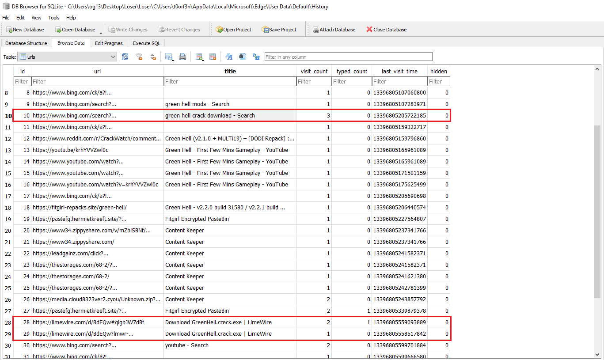

So the user was searching for a crack for a game called `Green Hell` as stated in the challenge description.

Let’s take a look at the `downloads` table.

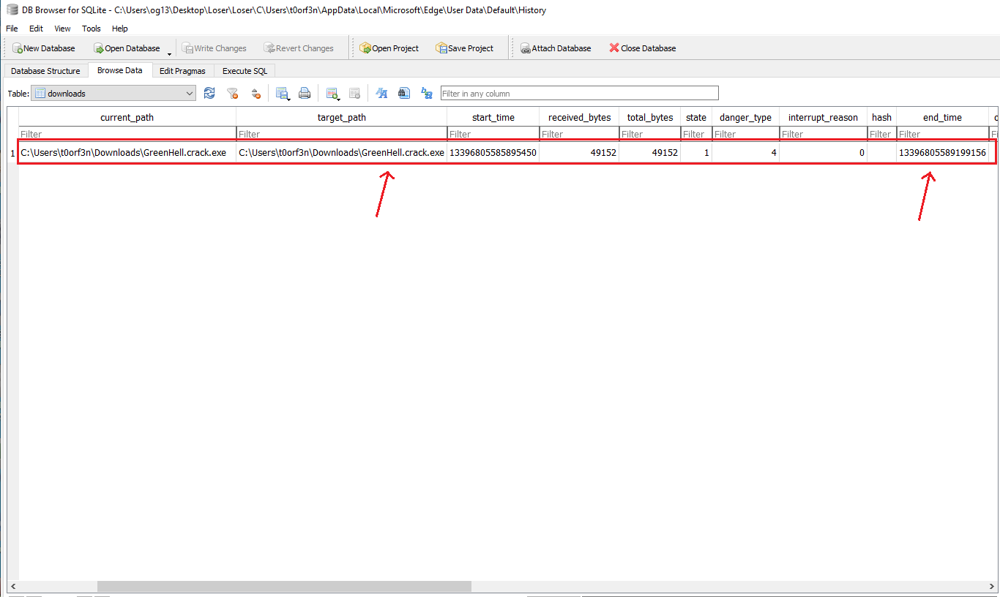

Okay, he downloaded a cracked version with the name `GreenHell.crack.exe`, we can convert the chrome timestamp in the `end_time` column to determine when the file was downloaded using [epochconverter.com/webkit](https://www.epochconverter.com/webkit).

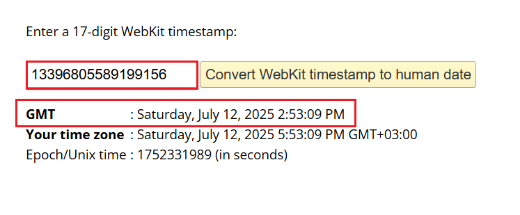

Okay, at this point, I thought I got the first part of the flag, which was asking about the name and path for the malicious file. I mean, we got its name and it was in the Downloads directory right?

Now we wanna determine the time the file was last executed.

So I thought about all the evidence of executions that log the last execution time, starting with prefetch files:

```
C:\Windows\Prefetch
```

There was no prefetch file for `GreenHell.crack.exe` :”

So I headed to `UserAssist` key.

```
HKCU\Software\Microsoft\Windows\CurrentVersion\Explorer\UserAssist
```

Nothing…

I thought about checking the `Amcache` hive, I know it doesn’t log the last execution time tho, but the hive itself wasn’t available in the artifacts.

Hmm..

Then while I was researching different evidence of executions, I stumbled upon [this resource](https://github.com/Psmths/windows-forensic-artifacts/blob/main/execution/program-compatibility-assistant.md), which talks about **PCA(Program Compatibility Assistant)**.

The PCA is a background Windows feature that identifies and resolves known compatibility issues with older desktop applications on newer versions of the operating system.

It’s a new evidence of execution artifact which was introduced in Windows 11, it’s located in:

```
C:\Windows\appcompat\pca
```

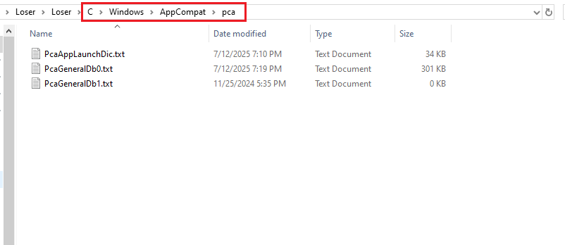

We got three files `PcaAppLaunchDic.txt`, `PcaGeneralDb0.txt`, and `PcaGeneralDb1.txt`.

`PcaAppLaunchDic.txt` contains the executable file path and the most recent execution timestamp for a given application.

`PcaGeneralDb0.txt` and `PcaGeneralDb1.txt` contains general information about the executed application like `Runtime`, `Run status`, `Executable path`, `Description of the file` and more valuable information.

I opened the `PcaAppLaunchDic.txt` and searched with our cracked game to get the full path and the execution timestamp.

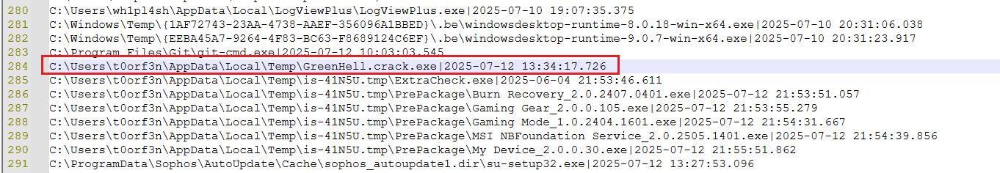

And then `PcaGeneralDb0.txt` to get the run status.

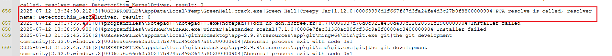

Now the full flag will be:

```
CATF{C:\Users\t0orf3n\AppData\Local\Temp\GreenHell.crack.exe_3_2025-07-12 13:34:17.726}
```

***

> **Dead Icons Speak**

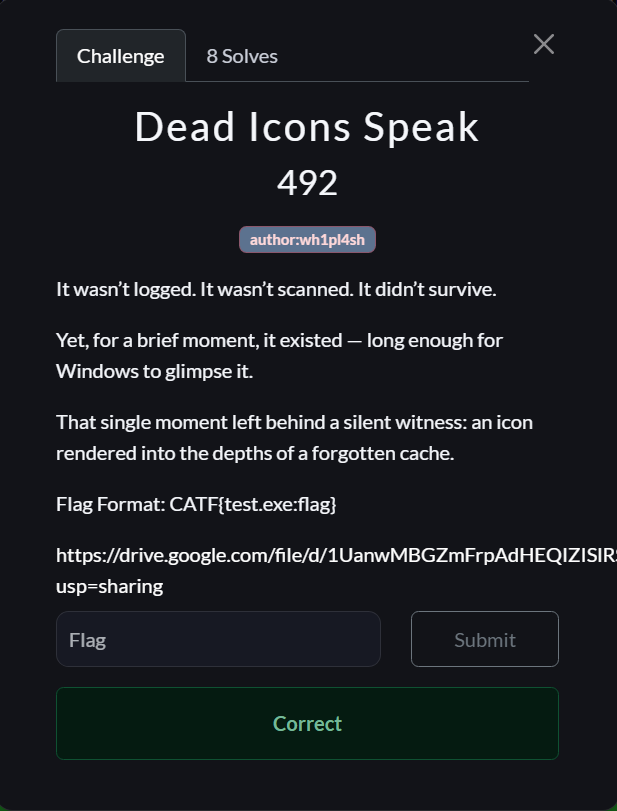

After extracting the zip archive, we got another triage acquisition for the `C:` drive, but with the `C:\Windows` directory missing.

TBH, at first I didn’t know how to think, and what should I look for…

We have a lot of missing artifacts, the `NTUSER.DAT` hive was empty, the browser history was empty..

I noticed that we have the `$LogFile` & `$MFT` available, so I thought why not to parse the `$MFT` and check the prefetch files for executed programs.

I used [MFTECmd](https://ericzimmerman.github.io/#!index.md) to do so.

```
MFTECmd.exe -f "MFT file path" --csv "output directory" --csvf "output filename"
```

Used this command to parse the `$MFT` file and write the output to a `.csv` file in the specified directory.

Let’s open the `.csv` file with [Timeline Explorer](https://ericzimmerman.github.io/#!index.md) and search with `.pf` which is the file extension for prefetch files.

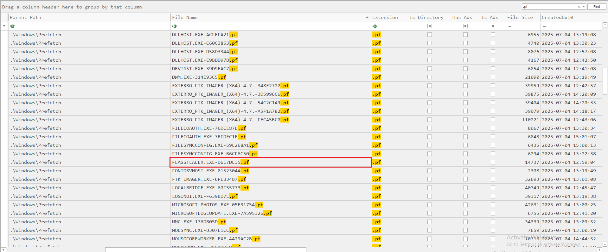

I scrolled a little bit until I noticed this executable filename `flagstealer.exe`. I think it’s pretty suspicious.

After that I returned to the chall description, maybe I can figure out anything I didn’t notice before.

The sentence `an icon rendered into the depth of a forgotten cache` made me think to check the rendered icon of the executable we found above.

Honestly, it was my first interaction with icon/thumbnail cache.

These are database files where Windows stores copies of file and folder icons, they’re stored in:

```
C:\Users\wh1pl4sh\AppData\Local\Microsoft\Windows\Explorer
```

I used [Thumbcache Viewer](https://thumbcacheviewer.github.io/) to open these database files and start loading the `iconcache_*.db` files.

After some time searching through the icons, we got the flag.

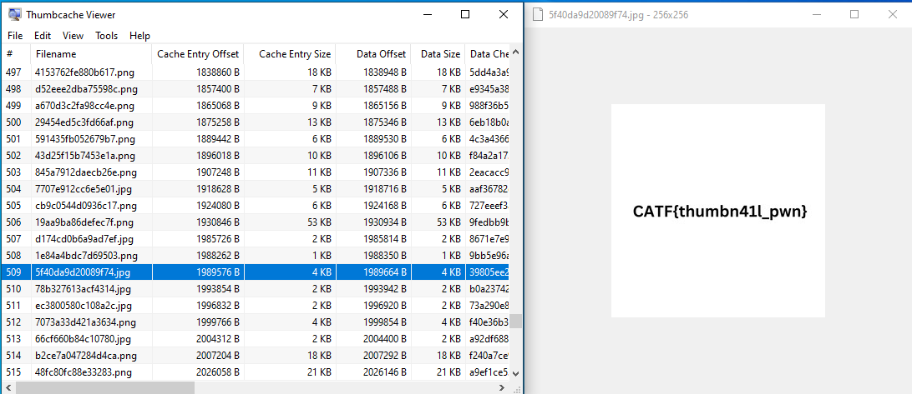

The final flag will be:

```
CATF{flagstealer.exe:thumbn41l_pwn}
```

***

> **Erased Traces**

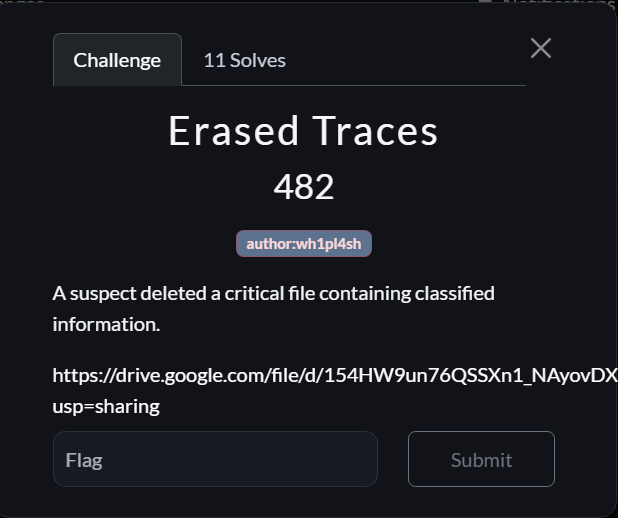

In this challenge we got a `.E01` disk image.

I opened the disk image using [FTK Imager](https://www.exterro.com/ftk-product-downloads/ftk-imager-4-7-3-81).

At first glance we can see four deleted files in the root directory with the names `CAT1`, `CAT2`, `CAT3`, and `CAT4`.

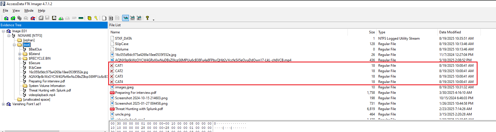

Our task is to recover these deleted files as the challenge description stated.

The first thing came to my mind is to do file carving.

I used `Photorec` but it didn’t recover anything, after it I tried `R-Studio` with no luck also it recovered four files full of null bytes :(

Hmm, ok maybe no luck with file carving..

After that what I thought of was to check if there is any available VSS restore points.

So I mounted the disk image using FTK Imager

`File > Image Mounting > Add Image File`

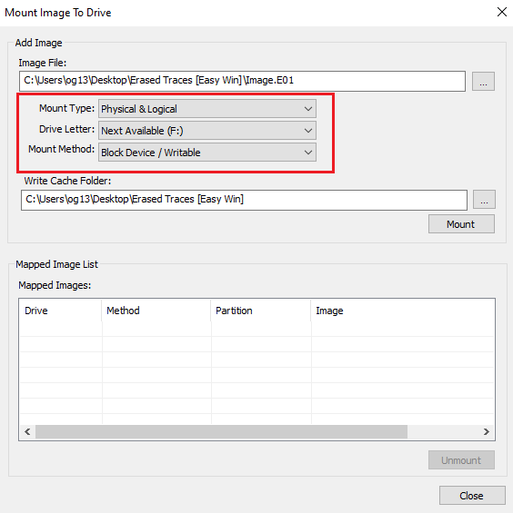

It’s very important to mount the disk as `writable` so the OS has write permissions to this mounted drive so it can access the volume shadow copies.

I used [ShadowExplorer](https://www.shadowexplorer.com/downloads.html) to view the shadow copies but to my surprise there weren’t any…

I tried to do it manually, open a command prompt with elevated privileges and list the the available shadow copies for this drive with the drive letter.

```
vssadmin list shadows /for=F:
```

Also got nothing..

Ok what else could it be!

I returned to the artifacts and noticed the `$LogFile` & `$MFT`, so I exported them from the disk image and then parsed them using [NTFS Log Tracker](https://sites.google.com/site/forensicnote/ntfs-log-tracker) to check the filesystem events for these files.

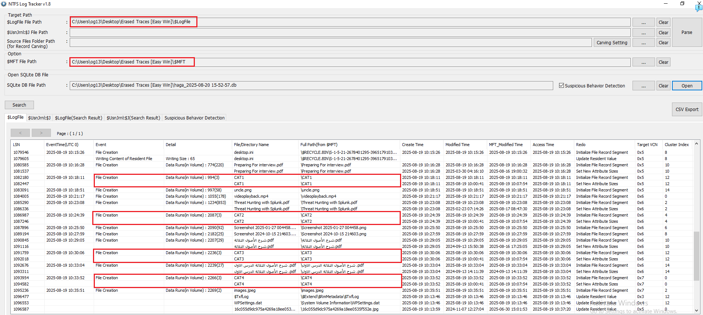

We can notice the `File Creation` events for the four files, but the actual important thing is the `Data Runs` we got in the Details tap.

The `Data Run` describes where and how much data of a file is stored on disk, it tells the filesystem `Start at cluster A and use B clusters`.

So here we have the first file `CAT1` starting at cluster `994` and allocate `3` clusters, the second file `CAT2` starting at cluster `2087` and allocate `3` clusters also and so on.

We need to calculate the `Start Offset` that the file data starts at.

Start Offset = Cluster Number * Cluster Size

Length = Cluster Count * Cluster Size

The default cluster size is `4096 bytes` which consists of `8 sectors` each one is `512 bytes`

I mounted the disk image and opened it in [HxD](https://mh-nexus.de/en/downloads.php?product=HxD20) with the `open disk` option and select the mounted physical disk.

Now we should calculate the start offset of the first file `994 * 4096 = 0x3E2000` and the length `3 * 4096 = 0x1000`

Press `Ctrl + E` to select a block.

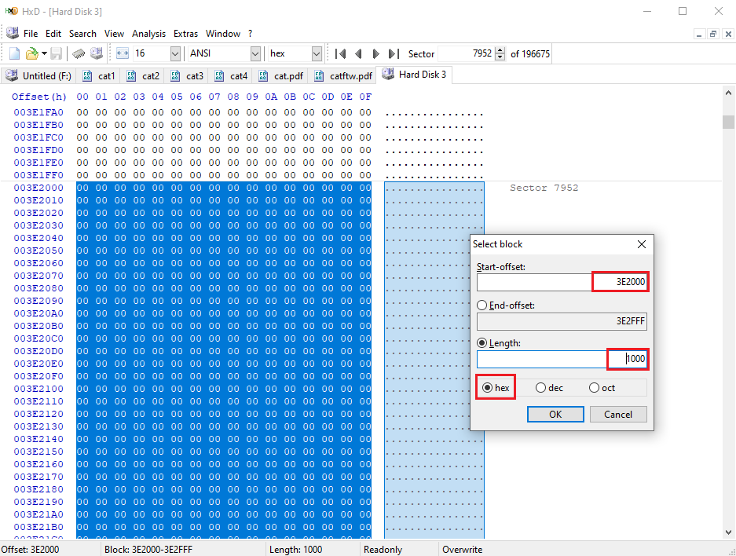

I searched with the offset and length we’ve calculated, it returned a block of null bytes..

I struggled with this for a while, then I asked the author. Shout out ma maan [wh1pl4sh](https://www.linkedin.com/in/ahmedmofawzy/) for the great challenges <’3

He told me to check the the cluster size again, so I double checked the cluster size.

`Right Click on the Mounted Drive > Format`

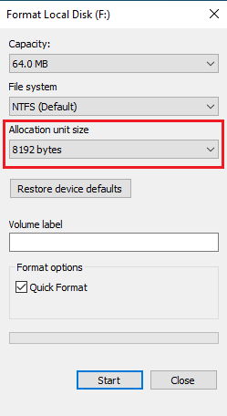

You can also check it from FTK Imager.

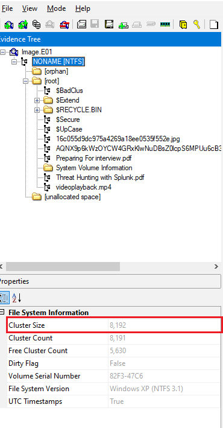

So the cluster size is changed to `8192` bytes not the default value

And that’s teaches us to not take anything for granted and always verify…

Now I’ve recalculated our offset and length, but what I was doing wrong during the CTF that I was opening the mounted disk as a `Physical Disk` not as a `Logical Drive` so this was also giving me null bytes and dummy data at the correct offset.

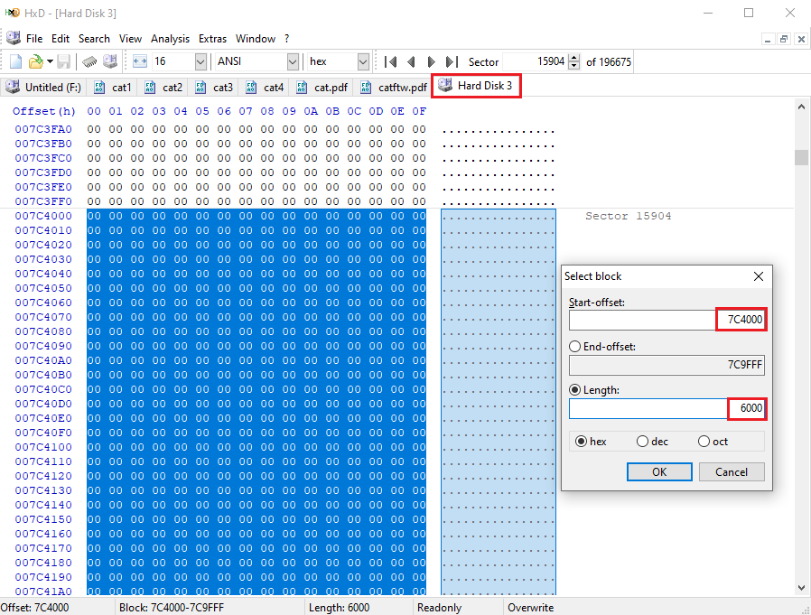

After the CTF ended I tried again but I opened the disk as logical drive.

The recalculated offsets (all in hex):

```
CAT1 -> 944  * 8192 = 7C4000  
CAT2 -> 2087 * 8192 = 104E000  
CAT3 -> 2236 * 8192 = 1178000  
CAT4 -> 2266 * 8192 = 11B4000  
Length -> 3  * 8192 = 6000
```

I searched with the offset of the first file.

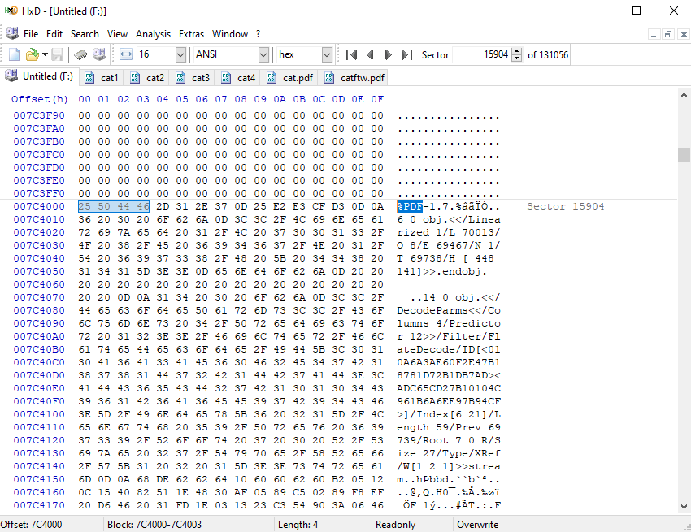

Finallyy, it’s a pdf document file header.

I copied this block and pasted it in a new file, and then checked the other files offsets.

Checking the last file `CAT4`, there is an EOF (End of File) marker.

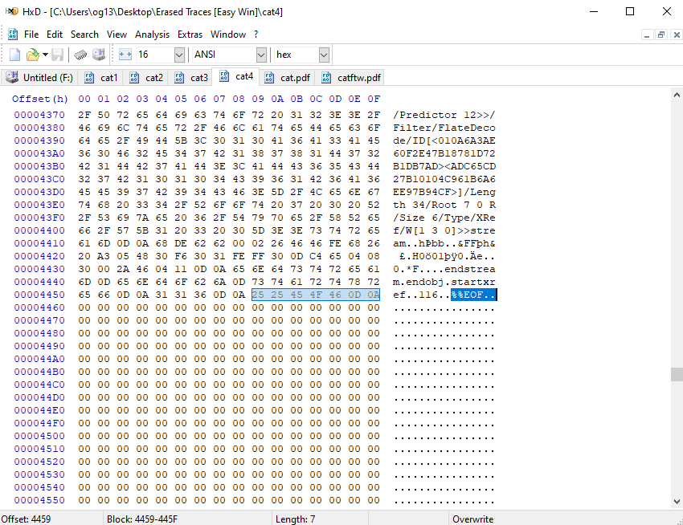

This means that they’re all segments for the same one file..

This segmentation that prevented the file carving tools from carving anything out, cuz they couldn’t determine where the file began and ended!

Now we need to concatenate all of these four segments.

But first we need to remove all of these null bytes from each file, otherwise the null bytes will overwrite the next segment, and we’ll end up having a corrupted document.

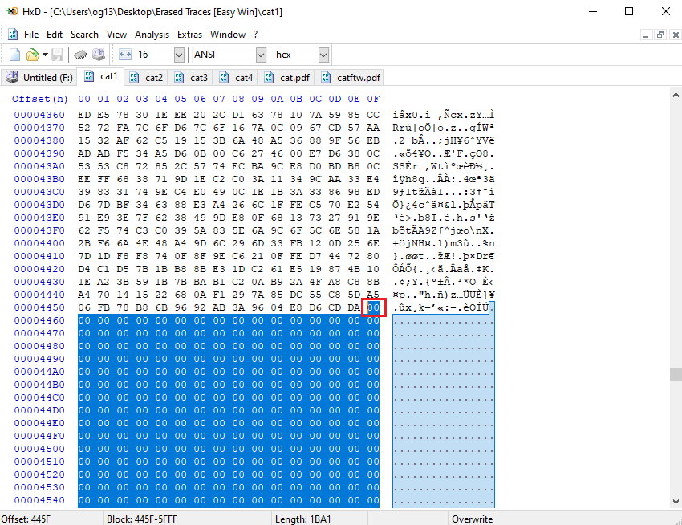

Don’t forget this sneaky byte also, I couldn’t recover the full flag because of this single byte..

Let’s concatenate em’ up.

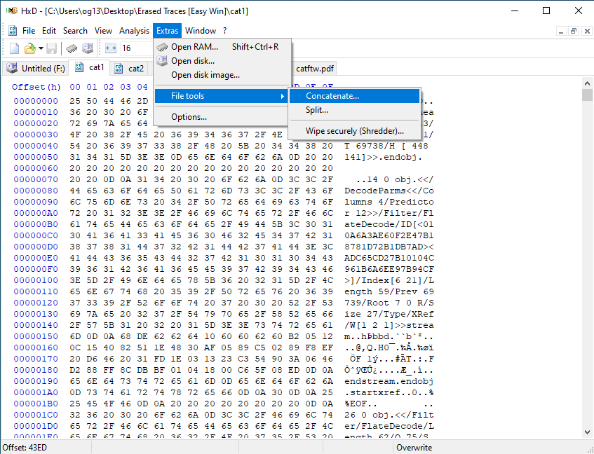

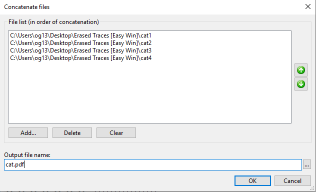

Now we should be good to go..

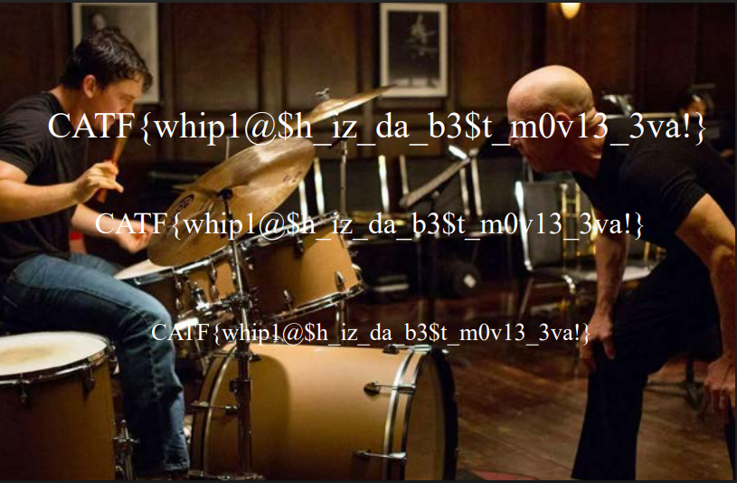

***

Thank you for your time,

I hope you enjoyed the reading and learned something new <’3

If you have any questions, don’t hesitate to reach out at: [OG13](https://linkedin.com/in/0g13/)